# Учет личных финансов — конфигурация 1С

Учебный мини-проект на платформе **1С:Предприятие** для учета личных финансов. Конфигурация разработана по итоговому заданию курса: учет доходов и расходов, переводы между счетами, планирование бюджета, учет долгов и аналитические отчеты.

> Репозиторий содержит **выгрузку конфигурации в файлы** (`src/`), скриншоты работы и исходное техническое задание. Платформа 1С и ее дистрибутивы в репозиторий не включены.

## Возможности проекта

- ведение счетов: банковские карты и наличные;
- справочник контрагентов;
- иерархические категории доходов и расходов;
- статьи движения денежных средств;
- регистрация поступлений дохода;
- регистрация расходов;
- переводы между счетами;
- планирование лимитов бюджета по категориям;
- выдача долга и учет задолженности;
- контроль остатка средств при расходе и переводе;
- предупреждение о превышении бюджетного лимита;
- отчеты по категориям, бюджету, долгам и оборотам по счетам.

## Реализованная бизнес-логика

В коде конфигурации реализованы движения по регистрам накопления и проверки при проведении документов. В частности:

- **Поступление дохода** увеличивает остаток выбранного счета и записывает сумму в регистр доходов.
- **Списание расхода** проверяет доступный остаток, формирует расход по счету, регистрирует расход по категории и учитывает использование бюджета.
- **Перевод между счетами** проверяет остаток счета-отправителя, списывает средства с него и зачисляет на счет-получатель.
- **Планирование бюджета** не позволяет установить отрицательный лимит и записывает план по категории на месяц.
- **Выдача долга** формирует движение в регистре долгов.

## Отчеты

В конфигурации присутствуют следующие отчеты:

- **Анализ по категориям** — сводные суммы по категориям с диаграммой;
- **Исполнение бюджета** — сравнение лимита и фактических расходов, расчет отклонения;
- **История долговых операций** — список операций по долгам;
- **Обороты по счетам** — свод прихода и расхода по счетам.

## Скриншоты

### Выдача долга

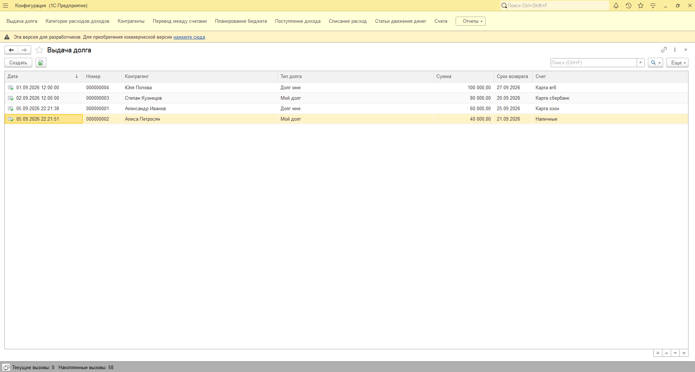

### Категории доходов и расходов

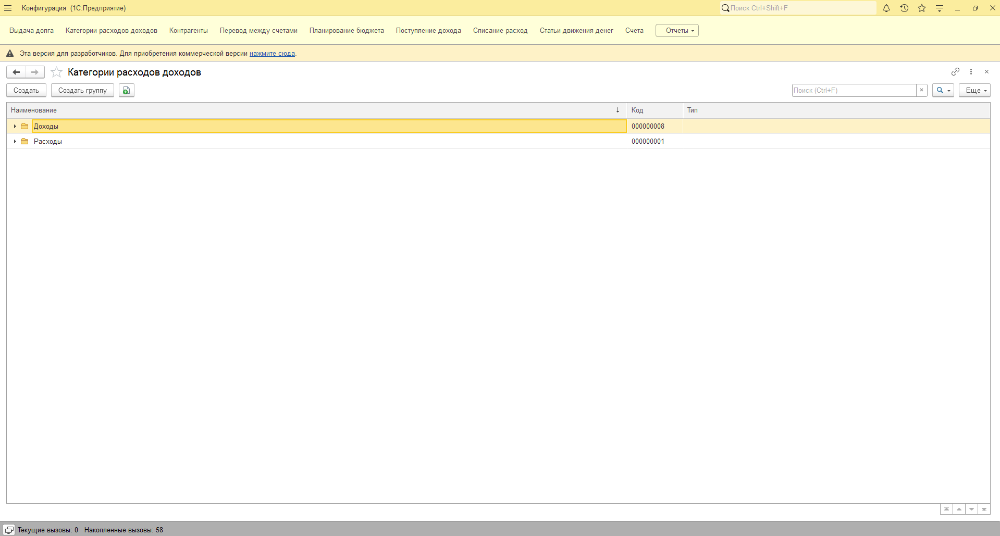

### Контрагенты

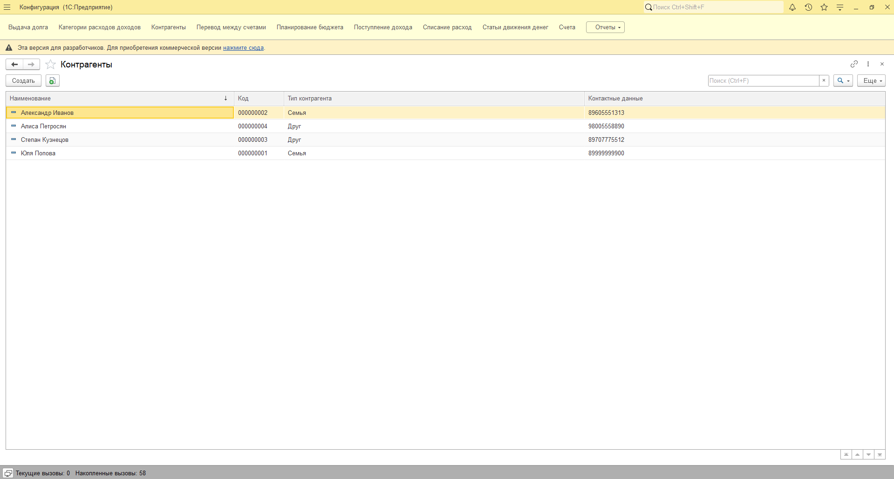

### Перевод между счетами

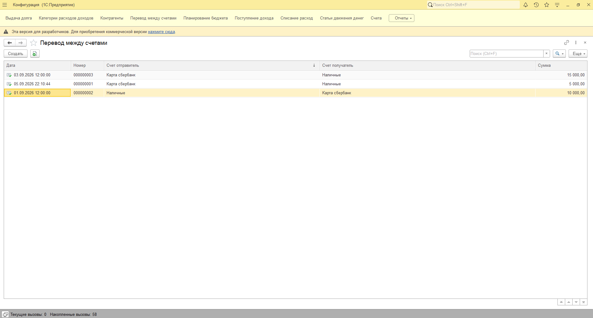

### Планирование бюджета

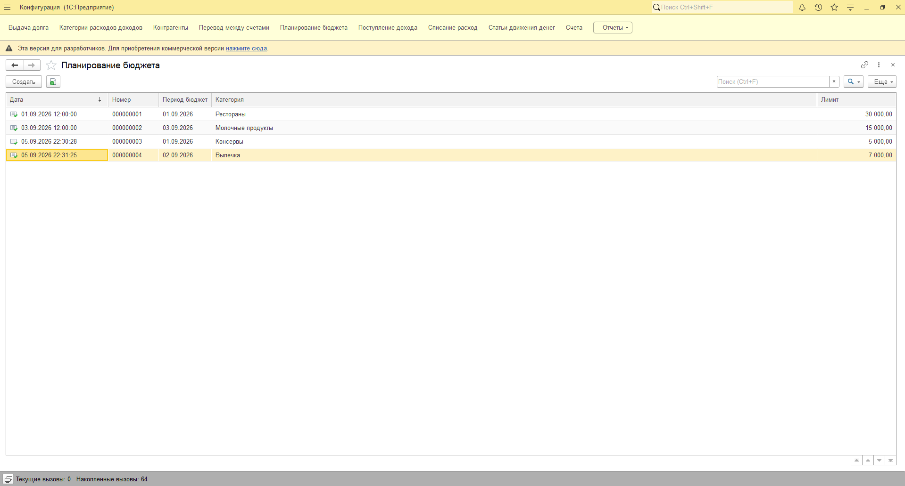

### Поступление дохода

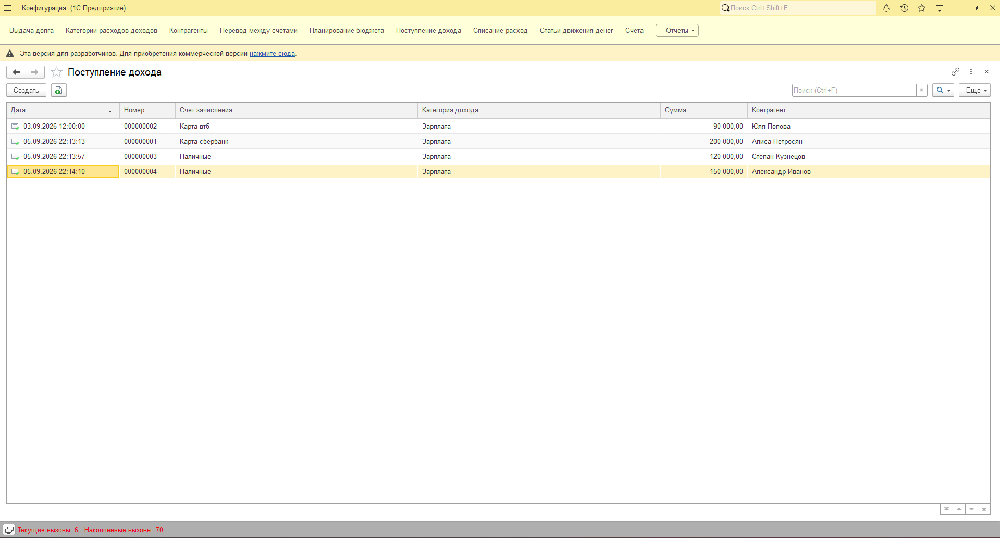

### Списание расхода

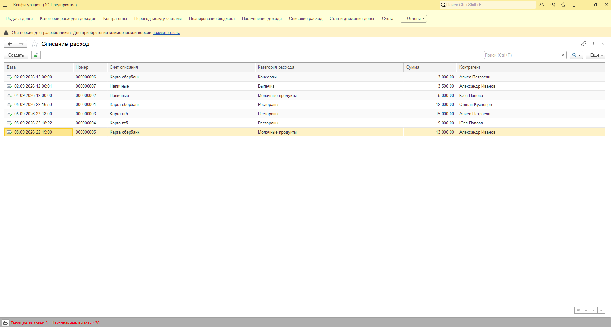

### Статьи движения денег

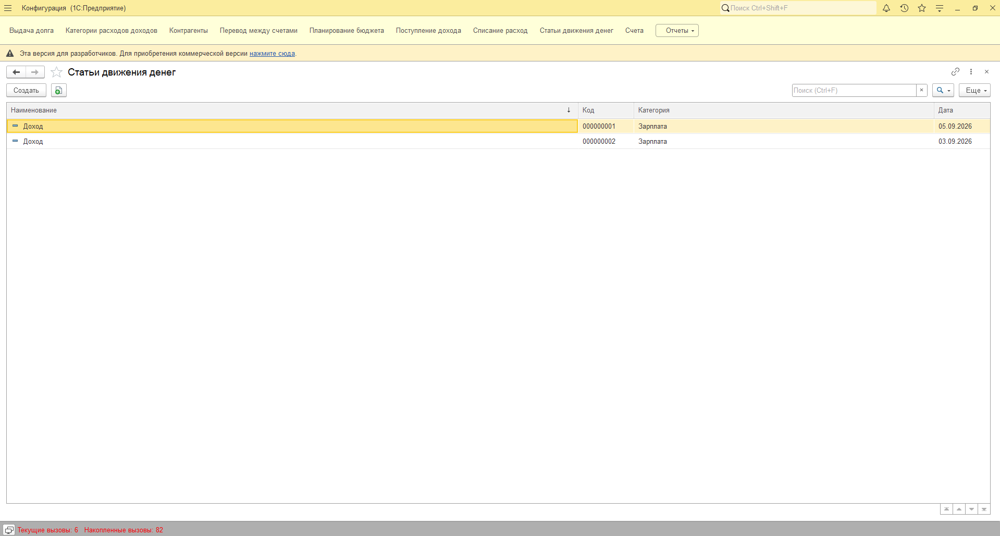

### Счета

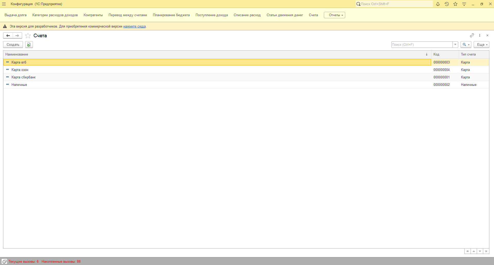

### Анализ по категориям

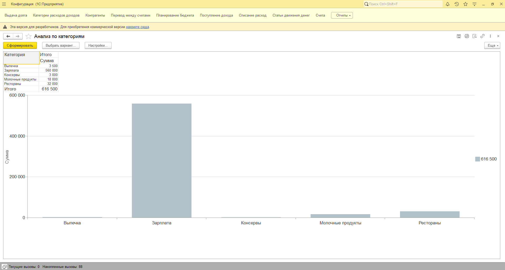

### Исполнение бюджета

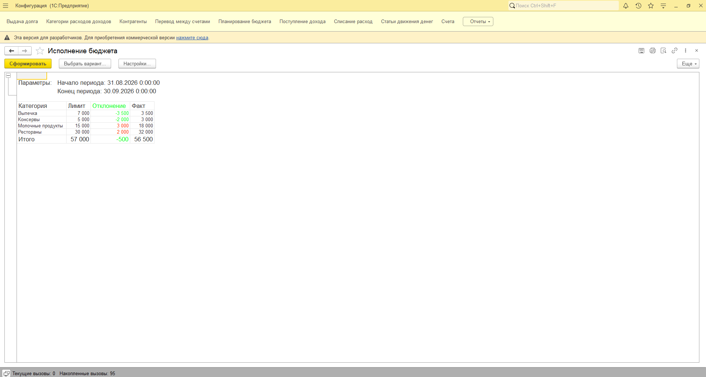

### История долговых операций

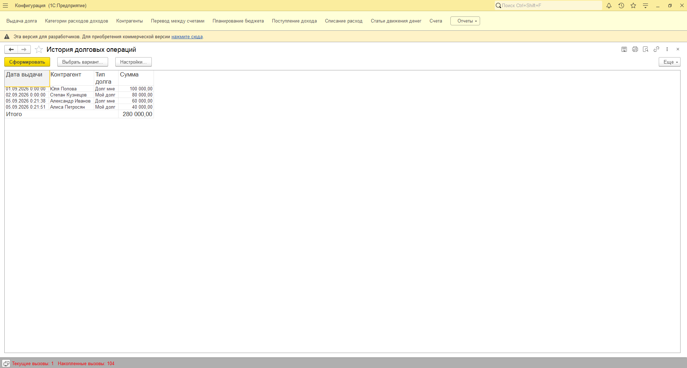

### Обороты по счетам

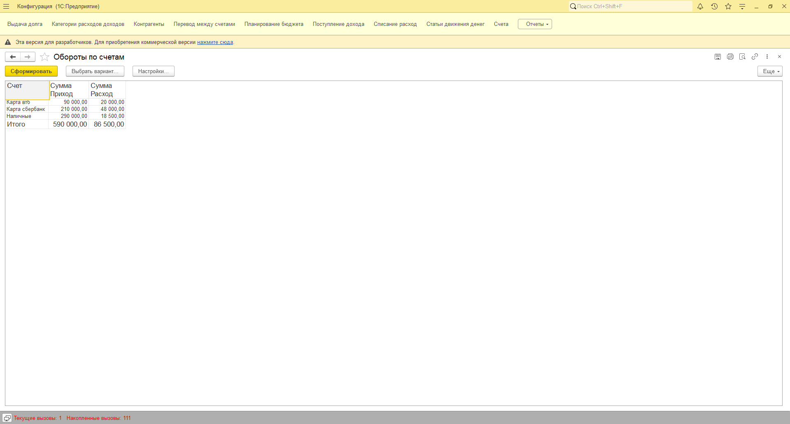

## Структура репозитория

```text
.
├── README.md
├── .gitignore
├── src/                         # выгрузка конфигурации 1С в файлы
│   ├── AccumulationRegisters/   # регистры накопления
│   ├── Catalogs/                # справочники
│   ├── Documents/               # документы и BSL-модули
│   ├── Enums/                   # перечисления
│   ├── Reports/                 # отчеты и СКД
│   ├── Configuration.xml
│   └── ConfigDumpInfo.xml
└── docs/
    ├── screenshots/             # скриншоты интерфейса
    └── assignment/              # исходное задание
```

> Имена части файлов в `src/` имеют вид `#U041...`. Это исходные имена из файловой выгрузки конфигурации 1С; они оставлены без переименования, чтобы не нарушать структуру выгрузки.

## Как открыть проект в 1С

1. Создайте пустую информационную базу в **1С:Предприятие 8**.
2. Откройте базу в режиме **Конфигуратор**.
3. Откройте конфигурацию.
4. Используйте команду **Конфигурация → Загрузить конфигурацию из файлов...**.
5. Укажите папку `src` из этого репозитория.
6. После загрузки выполните обновление конфигурации базы данных и запустите режим **1С:Предприятие**.

Точная совместимость зависит от версии платформы, на которой выполнялась выгрузка.

## Исходное задание

Техническое задание сохранено в [`docs/assignment/technical-task.pdf`](docs/assignment/technical-task.pdf).

В задании требовалась конфигурация для учета персональных финансов с документами доходов/расходов, переводами, бюджетированием, учетом долгов, регистрами накопления и аналитическими отчетами.

## Технологии

- 1С:Предприятие 8
- встроенный язык 1С (BSL)
- регистры накопления
- система компоновки данных (СКД)
- управляемое приложение

## Статус

Учебный проект / итоговая работа. Репозиторий предназначен для демонстрации структуры конфигурации, бизнес-логики и отчетности.
